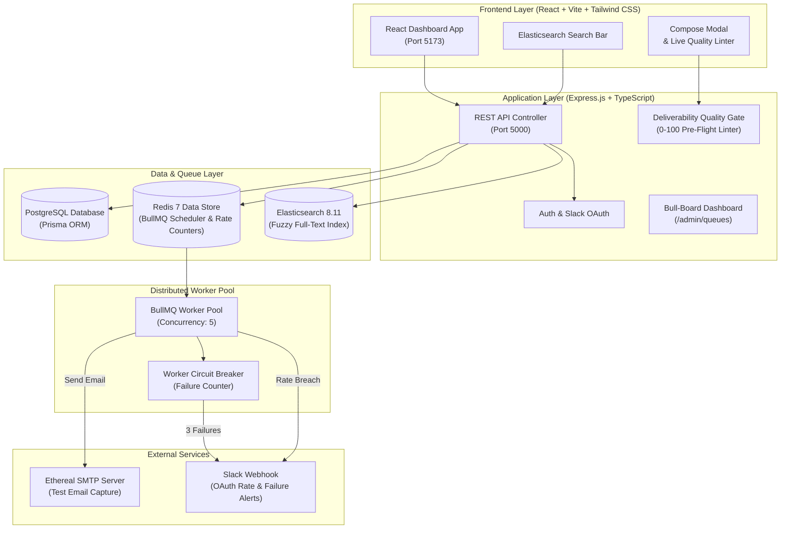

# ReachInbox Distributed Email Scheduler & Real-Time Dashboard


Production-grade, high-throughput cold outreach scheduling platform and queue monitoring system built with **Express.js**, **TypeScript**, **BullMQ**, **Redis**, **PostgreSQL (Prisma ORM)**, **Elasticsearch**, **Ethereal SMTP**, and **React**.

---

## 📐 System Architecture



### High-Level Component Flow

```
                      +-------------------+
                      |   React Dashboard |
                      |    (Vite / TS)    |
                      +---------+---------+
                                | REST API
                                v
                      +-------------------+
                      |   Express Backend |
                      |    (TypeScript)   |
                      +----+---------+----+
                           |         |
         +-----------------+         +------------------+
         | Persistence               | Job Scheduling    | Search Indexing
         v                           v                  v
+------------------+       +------------------+   +-------------------+
|  PostgreSQL DB   |       |   Redis Server   |   |   Elasticsearch   |
| (Prisma ORM)     |       | (BullMQ Queue)   |   |   (Search Engine) |
+------------------+       +--------+---------+   +-------------------+
                                    |
                                    v
                           +------------------+
                           |  BullMQ Worker   |
                           |  (Concurrency:5) |
                           +--------+---------+
                                    |
                    +---------------+---------------+
                    | Rate Limit                    | Send Mail
                    v                               v
          +------------------+            +-------------------+
          | Real Slack Alerts|            |   Ethereal SMTP   |
          | (OAuth / Webhook)|            | (Preview Capture) |
          +------------------+            +-------------------+
```

---

## 🔥 Key System Features

### ⚡ 1. Zero Cron Job Scheduling Engine
- Powered by **BullMQ** backed by **Redis sorted sets**.
- Eliminates polling intervals and scheduled cron tickers.
- Scheduled delays survive server restarts without job drops or duplicate sends.

### 🛡️ 2. Deliverability Quality Gate (Pre-Flight Linter)
- Real-time **0–100 Deliverability Health Score** computed on subject and body content.
- Scans for sales trigger words (`free`, `urgent`, `100%`, `guarantee`, `buy now`), excessive uppercase ratios (>35%), exclamation mark counts, and unhandled template variables (`{{firstName}}`).
- Blocks submission with **HTTP 422 Unprocessable Entity** if health score is below 70 (override available via `force: true`).

### ⛔ 3. Worker Circuit Breaker
- Tracks consecutive SMTP delivery failures in Redis (`worker:consecutive_failures`).
- On **3 consecutive failures**, automatically pauses queue execution (`await emailQueue.pause()`) and triggers an urgent Slack alert:
  > `🚨 Worker Circuit Breaker Tripped: Queue halted to prevent reputation degradation.`

### ⏱️ 4. Sender-Window Atomic Rate Limiting
- Enforces hourly limit thresholds per sender via atomic Redis counters (`rate:{sender}:{YYYY-MM-DD-HH}`).
- Excess jobs exceeding hourly limits are automatically postponed to the start of the next hour window without dropping.
- Triggers a real-time Slack notification on the exact job that breaches the sender's threshold.

### 🔍 5. Elasticsearch Full-Text Search
- Asynchronously indexes all scheduled and sent emails into an **Elasticsearch 8.11** cluster.
- Provides fuzzy multi-field search across recipient addresses, subjects, and email body text.

### 📊 6. Visual Queue Monitoring
- Mounts an interactive visual BullMQ administration dashboard powered by `@bull-board/express` at `/admin/queues`.

---

## 📡 REST API Reference

| Method | Endpoint | Description |
| :--- | :--- | :--- |
| `POST` | `/api/auth/login` | Authenticate or upsert user account |
| `POST` | `/api/emails/lint` | Perform pre-flight deliverability health lint check |
| `POST` | `/api/emails/schedule` | Queue campaign jobs with Quality Gate validation |
| `GET` | `/api/emails/scheduled` | Fetch scheduled email jobs for active user |
| `GET` | `/api/emails/sent` | Fetch sent email history with Ethereal preview links |
| `GET` | `/api/emails/search?q=...` | Perform fuzzy full-text search via Elasticsearch |
| `GET` | `/api/slack/install` | Initiate Slack OAuth authorization flow |
| `GET` | `/api/slack/callback` | Process Slack OAuth callback & save webhooks |
| `GET` | `/admin/queues` | Live visual BullMQ Queue Monitoring UI |

---

## 🚀 Quick Start Guide

### 1. Start Infrastructure Containers
```bash
docker compose up -d
```
*(PostgreSQL 15 on port `5432`, Redis 7 on port `6379`, Elasticsearch 8.11 on port `9200`)*

### 2. Configure Backend Server
```bash
cd backend
npm install
npx prisma db push
npm run dev
```
Backend API will start listening on `http://localhost:5000`.

### 3. Launch Frontend Dashboard
```bash
cd ../frontend
npm install
npm run dev
```
Frontend Vite dashboard will launch on `http://localhost:5173`.

---

## 🧪 Demo Verification Scenarios

1. **Server Restart Persistence**:
   Schedule 3 emails 2 minutes into the future. Stop the backend server (`Ctrl + C`). Restart the server (`npm run dev`). Observe jobs fire at their intended timestamps without duplicate execution.

2. **Deliverability Quality Gate**:
   Type spam-heavy copy (e.g. `"FREE URGENT WINNER 100% GUARANTEE!!"`). Observe the Deliverability Health Score badge drop to RED (`30/100`). Attempting to schedule without checking the bypass toggle returns a `422` error warning.

3. **Rate Limit & Slack Alert**:
   Set hourly limit to `2` in the Compose modal. Schedule `4` emails. Observe the first 2 send successfully, the 3rd triggers a Slack notification, and excess jobs transition to `RATE_LIMITED_RESCHEDULED`.

4. **Elasticsearch Search**:
   Type recipient addresses or body keywords in the top dashboard search bar to verify full-text search results returned from Elasticsearch.
